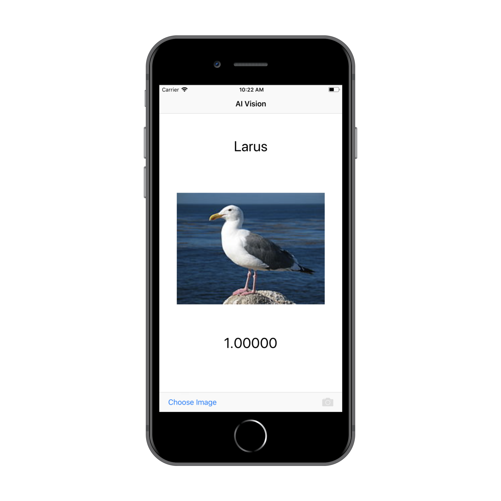

# AI Vision iOS

This native Swift iOS application is designed to take models trained in [PowerAI Vision](https://developer.ibm.com/linuxonpower/deep-learning-powerai/technology-previews/powerai-vision/) and deploy them into a mobile app. 

## Description

The simple UI lets you select an image from the device camera or camera roll and then classify the image against the PowerAI Vision API.

## Screenshot

## FAQ

Please feel free to raise any questions as issues against this GitHub repo!